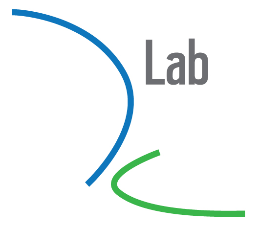

# Computational text analysis: A brief introduction for TextXD 2019

[](https://mybinder.org/v2/gh/jhaber-zz/computational-text-analysis-intro-2019/master)


## Overview

This workshop will equip newcowers with the cornerstones of a foundation for applying computational text analysis methods in their work. The focus is on high-level descriptions of what existing methods do and user-friendly implementations. It's drawn from the first day of a [four-day workshop on computational text analysis held at the D-Lab](https://github.com/dlab-berkeley/computational-text-analysis-spring-2019). The following days cover regular expressions, unsupervised methods, and supervised methods. 

## What you'll learn
* what computational text analysis can do, and what it can't do
* preprocessing text data

* where to go next to learn and seek help with your computational text analysis projects

## Prerequisites

We will get our hands dirty implementing some of the methods. This will be in Python. If you would like to follow along with the implementation details, you will need some familiarity with Python. If you haven't programmed in Python or at all, you are of course welcome to participate and learn the big ideas behind the methods.

## Getting started & software prerequisites

For simplicity, just click the "Launch Binder" button to create a virtual environment ready for this workshop. 

If you want to run the code on your computer, you have two options. You could use [Anaconda](https://www.anaconda.com/what-is-anaconda/) to make installation easy: [download Anaconda](https://www.anaconda.com/download/) . Or if you already have Python 3.x installed with the full list of libraries listed under `requirements.txt`, you're welcome to clone this repository and follow along on your own machine. You can also install all the necessary packages like so: 

```
pip3 install -r requirements.txt
```

## IOKN2K

It's OK Not To Know! That's our motto at [D-Lab](http://dlab.berkeley.edu/). D-Lab is open to researchers and professionals from all disciplines and levels of experience.

## Resources

* [CTAWG (Computational Text Analysis Working Group) website](http://dlabctawg.github.io)
* [Lectures from Stanford's NLP class](https://www.youtube.com/watch?v=nfoudtpBV68&list=PL6397E4B26D00A269)
* [Workshops on NLTK and SpaCy at the D-Lab](https://github.com/geoffbacon/nlp-with-nltk-spacy)
* [Computational Text Analysis 4-day workshop at the D-Lab](https://github.com/dlab-berkeley/computational-text-analysis-spring-2019)
* [Info 256 Spring 2019 - Applied NLP class by David Bamman](https://www.ischool.berkeley.edu/courses/info/256)

## Contributing

If you spot a problem with these materials, please make an issue describing the problem.

## Acknowledgments

* [Ben Gebre-Medhin](http://gebre-medhin.com)
* [Laura Nelson](http://www.lauraknelson.com)
* [Teddy Roland](https://teddyroland.com/about/)
* [Geoff Bacon](http://linguistics.berkeley.edu/~bacon/)
* [Caroline Le Pennec-Caldichoury](https://dlab.berkeley.edu/people/caroline-le-pennec)

These materials have evolved over a number of years. They were first developed for the [D-Lab](http://dlab.berkeley.edu) by Laura Nelson & Teddy Roland, with contributions and revisions made by Ben Gebre-Medhin, Geoff Bacon, and most recently by Caroline Le Pennec-Caldichoury.


